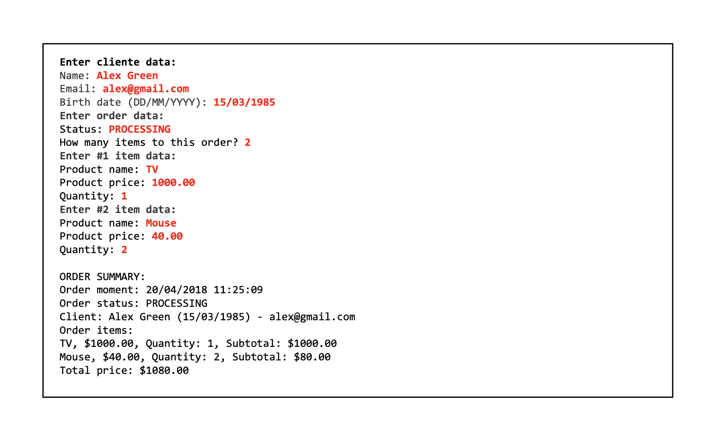

# Exercicio 01 Java:

> ℹ️ Detalhes: Exercicio proposto no curso do [nelio alves - acenelio](https://github.com/acenelio) onde deve-se fazer uma simulação simples de 
uma lista de pedidos de um cliente, durante o processo sera pedido os dados do cliente (nome, email e  data de nascimento), logo em seguida
será solicitado os produtos que ele deseja e no final deve-se mostrar os dados do cliente, o status do pedido, a data do pedido e as informações do
pedido como nome dos produtos, valor unitario, valor total e total da compra. Segue abaixo o diagrama de classe e um exemplo de como ficaria:

- 👀 Exemplos: 

  - Diagrama de Classes:
  
  
  - Exemplo:
    
    
  - Diagrama de classes com exemplo
    
    
- 🚧 melhorias a serem feitas 🚧 :
  
  - [ ]  O sistema somente pega a data do pedido e não a hora, logo mais será implementado a hora do pedido tambem e mostrado na tela dia e hora do pedido.
  
## 💻 Pré Requisitos 💻:

- Sistema operacional: Qualquer Distribuição Linux, Windows e Mac OS

- Instalação: é necessario ter o java 18(jre e sdk) instalado em sua maquina para testar e qualquer IDE java ou um editor de sua preferencia que consiga
compilar java.

## 📃 Como usar:

  1. Faça o clone do projeto

  2. abra na sua IDE ou editor de preferencia

  3. Teste como quiser.

## 🌐 Link do exercício original: 

[**https://github.com/devsuperior/aulao004**](https://github.com/devsuperior/aulao004)
